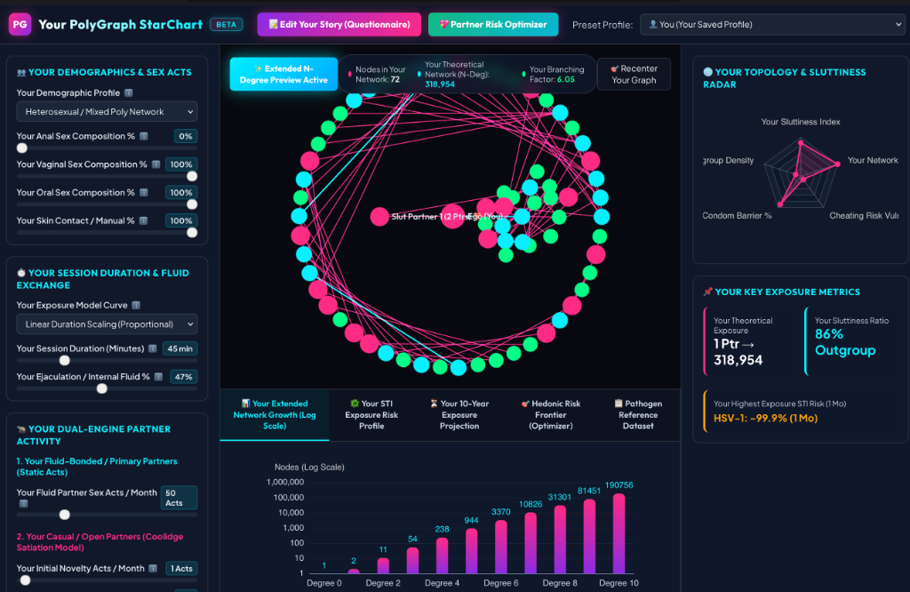

# Your PolyGraph StarChart — Extended Sexual Network & STI Epidemiology Visualizer



👉 **Live Web Application**: [https://dioptre.github.io/polygraph/](https://dioptre.github.io/polygraph/)

**Your PolyGraph StarChart** is an interactive, browser-based mathematical visualization and epidemiological modeling platform. It simulates complex sexual networks—ranging from closed monogamous pairs to open polyamorous polycules, high-degree party subcultures, and slutty connector orbits—and computes longitudinal transmission risks across sexually transmitted infections (STIs) under varying prophylactic scenarios (Condoms, PrEP/U=U, Doxy-PEP, and Vaccines).

---

## ✨ Primary Features & Capabilities

- **💖 Primary Partner Risk & Hedonic Optimizer**: Runs Monte Carlo simulations (5,000 runs per second) to calculate maximum sexual fulfillment ("Max Sex") within your primary partner's exact risk budget (antibiotic treatment frequency, HIV policy, target polycule size, and polycule loyalty).
- **🎯 Hedonic Risk Frontier Chart**: Renders an interactive Pareto frontier scatter plot comparing Monthly Bacterial Risk % vs Hedonic Intimacy Score across Tier 1 (Bareback Polycule), Tier 2 (Sex Party Loopback), and Tier 3 (Max Slut Orbit) stages.
- **⚡ Sex Party & Subculture Loopback (%)**: Models triadic closure in sex parties and festival scenes, reflecting hookup networks where partners frequently share mutual friends.
- **🐀 Dual-Engine Partner Activity Model**: Combines static primary partner encounter frequency with an exponential Coolidge Effect satiation decay model for casual lovers:
  $$A_{\text{casual}}(m) = A_{\text{floor}} + (A_{\text{initial}} - A_{\text{floor}}) \cdot e^{-\lambda \cdot m}$$
- **🛡️ Comprehensive Biomedical Armor**: Models condom efficacy alongside PrEP/U=U ($0.001\times$ HIV multiplier), Doxy-PEP (~87% bacterial STI reduction), Gardasil-9 (HPV), JYNNEOS (Mpox), and Hepatitis B vaccination.
- **📝 Rolling Stone / Penthouse Style Questionnaire Overlay**: Human-centric 5-chapter story interview allowing users to configure intimacy parameters with floating glassmorphism tooltips.

---

## 📚 Key Concepts, Demographics & Glossary Definitions

### 👥 Demographic Profiles

* **MSM / Gay & Bisexual Men / TGNC (San Francisco Baseline)**: Models network dynamics among men who have sex with men and trans/gender-non-conforming individuals. Features elevated mucosal anal and pharyngeal transmission weighting, high extragenital STI rates (rectal/pharyngeal chlamydia & gonorrhea), and citywide biomedical prophylaxis baselines (PrEP and Doxy-PEP).
* **WSW / Cisgender Women (Female-to-Female)**: Adjusts transmission modes for women who have sex with women. Zeroes out penile-vaginal and penile-anal exposure modes, scales HIV transmission risk down by $0.001\times$ (near-zero for non-IDU WSW), and accurately models fluid and skin contact pathogens (Bacterial Vaginosis, HSV-1, HSV-2, HPV, Trichomoniasis, Candidiasis).
* **Heterosexual / Mixed Poly Network**: Standard mixed-gender network incorporating penile-vaginal, anal, oral, and skin contact sex act distributions.
* **Kink / BDSM / Play Party**: Incorporates a **1.7× Mucosal Trauma Multiplier** for high-intensity play, manual play/fisting, or heavy friction acts.
* **San Francisco High-Risk / ENM**: Reflects SFDPH public health department epidemic data, emphasizing 3-site NAAT testing, extragenital site infection dynamics, high PrEP/Doxy-PEP awareness, and macrolide-resistant *Mycoplasma genitalium*.

---

### 🩸 What is the Trauma Multiplier?

In epidemiological research, **mucosal micro-trauma** refers to microscopic friction tears or abrasions in mucosal tissue (rectal, vaginal, or oral) and skin that occur during high-intensity or rough sexual play.

#### Biological Mechanism:
1. **Barrier Disruption**: Intact mucosal membranes act as natural physical defenses. Friction or tension creates micro-abrasions in the fragile epithelial lining.
2. **Direct Bloodstream Access**: Micro-tears expose sub-mucosal capillaries and target immune cells (CD4+ T-cells, Langerhans cells, and dendritic cells), allowing pathogens to bypass primary mechanical barriers.
3. **Model Calculation**: When the **Kink / BDSM / Play Party** profile is selected, PolyGraph applies a **1.4× to 1.7× risk multiplier** to specific blood-borne, fluid-borne, and ulcerative pathogens:
   * **HIV-1 & HIV-2** ($1.4\times - 1.7\times$): Micro-tears provide direct viral entry to CD4+ T-cells in sub-mucosal tissue.
   * **Hepatitis C Virus (HCV)** (Primary driver): Sexual HCV transmission occurs almost exclusively through traumatic manual play/fisting.
   * **Syphilis (*T. pallidum*)** ($1.5\times$): Spirochetes rapidly inoculate through micro-abrasions.
   * **Mpox Virus & HSV-1/HSV-2** ($1.4\times - 1.6\times$): Skin friction accelerates epidermal cell inoculation.

---

### 🌉 What is the San Francisco High-Risk Profile?

The **San Francisco High-Risk** profile is grounded in **San Francisco Department of Public Health (SFDPH)** epidemiological data and subcultural demographics:

1. **Extragenital STI Predominance (70%–75%)**: In SF's MSM and polyamorous communities, 70%–75% of Chlamydia and Gonorrhea infections are pharyngeal (throat) or rectal. Standard urine-only testing misses up to 70% of infections.
2. **Citywide Doxy-PEP Guidelines**: SFDPH was the first jurisdiction to roll out citywide Doxy-PEP (200 mg doxycycline within 72 hours of condomless sex), yielding an ~87% drop in Chlamydia/Syphilis and a ~45–55% drop in Gonorrhea.
3. **High PrEP Uptake ("Getting to Zero")**: PrEP usage exceeds 75–80% among high-risk groups, causing annual HIV incidence to drop while bacterial STIs (unaffected by PrEP) dominate transmission concerns.
4. **Macrolide Resistance (*M. genitalium*)**: >70–80% of *Mycoplasma genitalium* cases in SF exhibit Azithromycin resistance, requiring two-step resistance-guided therapy.

---

### ⏱️ Session Duration, Ejaculation Exposure & Mathematical Curves

PolyGraph models how the physical characteristics of a sexual encounter impact transmission risk:

1. **Session Duration (Minutes)**:
   * Longer encounters increase cumulative fluid exposure time and mechanical micro-friction.
   * **Logarithmic Saturation Model (Default)**: Incorporates diminishing returns on fluid exchange and mucosal lubrication equilibrium:
     $$M_{\text{duration}} = 1.0 + 0.5 \cdot \ln\left(1 + \frac{\text{Duration}_{\text{min}}}{20}\right)$$
   * **Linear Scaling Model**: Direct proportional multiplier on session length:
     $$M_{\text{duration}} = 0.5 + 0.5 \cdot \left(\frac{\text{Duration}_{\text{min}}}{20}\right)$$
2. **Ejaculation / Internal Fluid Release Probability (%)**:
   * Ejaculation transfers high-viral/bacterial-load seminal fluid into mucosal spaces. Non-ejaculatory sex (withdrawal or pre-cum only) carries a reduced fluid transfer factor ($F_{\text{fluid}} \approx 0.30\times$).
   * Weighted Fluid Exposure Multiplier:
     $$M_{\text{fluid}} = \left(\frac{\text{ejaculationPct}}{100} \cdot 1.0\right) + \left(\left(1 - \frac{\text{ejaculationPct}}{100}\right) \cdot 0.30\right)$$
   * Applied to fluid-borne pathogens (HIV, Hepatitis B, Chlamydia, Gonorrhea, Trichomoniasis, Mgen), while skin-to-skin pathogens (HSV, HPV, Mpox) scale primarily via duration and skin contact.

---

### 🧮 Mathematical Engine & Methodology

PolyGraph's engine (`src/riskCalculator.js`, `src/networkGenerator.js`, and `src/partnerOptimizer.js`) translates relational graph topology into probabilistic transmission metrics:

#### 1. Network Topology Generation
* **Ingroup Polycules**: Modeled as densely connected clusters with high internal edge density and configurable group size ($N$).
* **Sex Party Triadic Closure (Loopback %)**: Connects extended hookup partners back to mutual friends within the party scene.
* **Bridge Nodes ("Outgrouping" / "Sluttiness Index")**: Nodes configured with high degree centrality that connect distinct polycule clusters or external partners.
* **Monogamous Cheating Hops**: Secret edges added probabilistically ($\text{CheatingLikelihood}$).

#### 2. Weighted Per-Act Transmission Rate ($p_{\text{act}}$)
$$\text{Weighted Risk} = (w_{\text{anal}} \cdot p_{\text{anal}}) + (w_{\text{vag}} \cdot p_{\text{vag}}) + (w_{\text{oral}} \cdot p_{\text{oral}}) + (w_{\text{skin}} \cdot p_{\text{skin}})$$

---

## 🛠️ Local Development & Setup

```bash
# 1. Install dependencies
npm install

# 2. Start local development server
npm run dev

# 3. Build production bundle (dist/)
npm run build
```

---

## 📁 Repository Structure

```
polygraph/
├── public/
│   ├── app_screenshot.png                           # Application interface screenshot
│   └── sexual_health_sti_model_data.csv             # 32 Pathogen STI dataset
├── src/
│   ├── chartsManager.js                             # ECharts STI & Hedonic Frontier chart rendering
│   ├── graphVisualizer.js                           # Sigma.js / Graphology network canvas
│   ├── main.js                                      # Application controller & event handling
│   ├── networkGenerator.js                          # Graph generator (Ingroups, Sluts, Loopback)
│   ├── partnerOptimizer.js                          # Monte Carlo Risk-Frontier Optimizer Engine
│   ├── riskCalculator.js                            # Probabilistic epidemiological engine
│   ├── stiData.js                                   # PapaParse CSV loader & parser
│   └── style.css                                    # Dark mode CSS theme & styles
├── index.html                                       # Main application layout & UI controls
├── package.json                                     # Project metadata & NPM dependencies
├── STI_Epidemiology_Prophylactics_and_Demographics_Report.md  # Primary research document
├── README.md                                        # Project documentation & definitions
└── vite.config.js                                   # Vite configuration
```

---

## 📜 License

This project is licensed under the **ISC License**.
